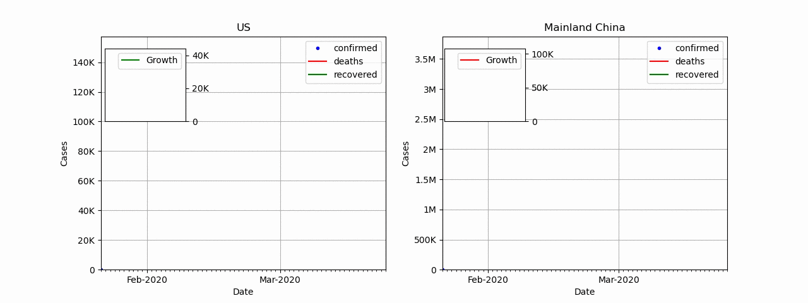
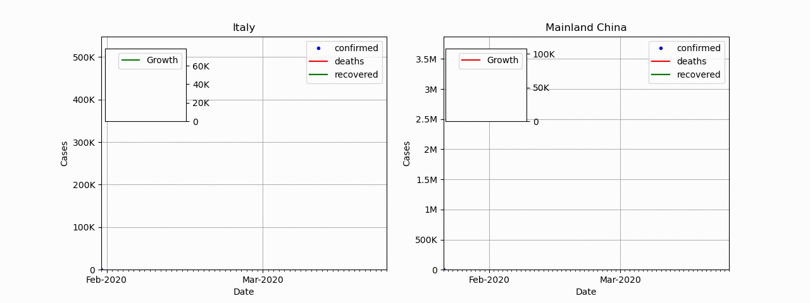

# SARS-COV-2 (Corona-Virus) Comparison Animation
### SARS-COV-2 Comparison tool




This is a tool I made in python requiring only **matplotlib** and **numpy** to plot an animation of SARS-COV-2 statistics based on
[This dataset](https://www.kaggle.com/sudalairajkumar/novel-corona-virus-2019-dataset/data#covid_19_data.csv)

### Usage
The following are required to run the program
1. Python >= 3.6 (May work on previous versions)
2. Matplotlib
3. Numpy (version 1.18.2)

Before running, ensure the file "./covid_19_data_hinted_accurate.csv" is available with your data. I would advice using excel to 
remove occurrences of commas as the can alter the behavior of numpy recvfromcsv. A sample of the data is available. A copy of the
data in csv is available however you would need to visit the link to get more up to date data.
Link is [This dataset](https://www.kaggle.com/sudalairajkumar/novel-corona-virus-2019-dataset/data#covid_19_data.csv)

then simply run

```bash
python3 covid_19_anim.py
```
It will prompt for input, follow instructions notes as indicated and the plot should show

# Saving animation

to save the animation locally, simply uncomment lines 496, 497 and 500. You may need to have FFmpeg to achieve this

# Blog Post
Coming soon

##### Please like and share if you found the tool interesting
